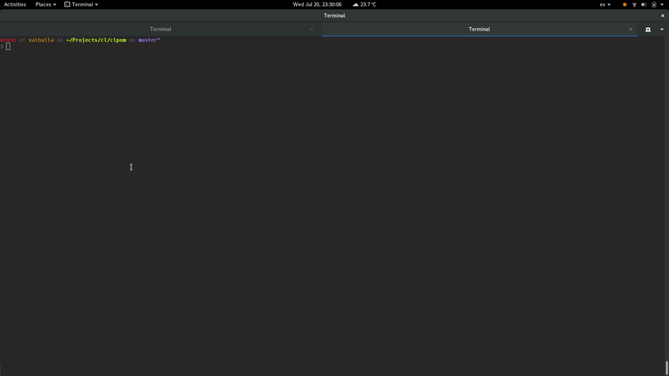
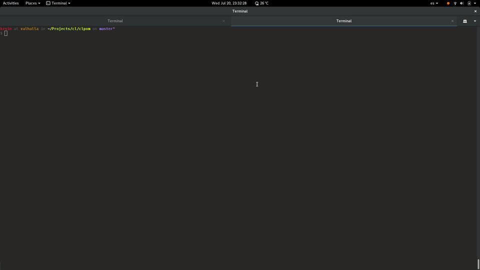
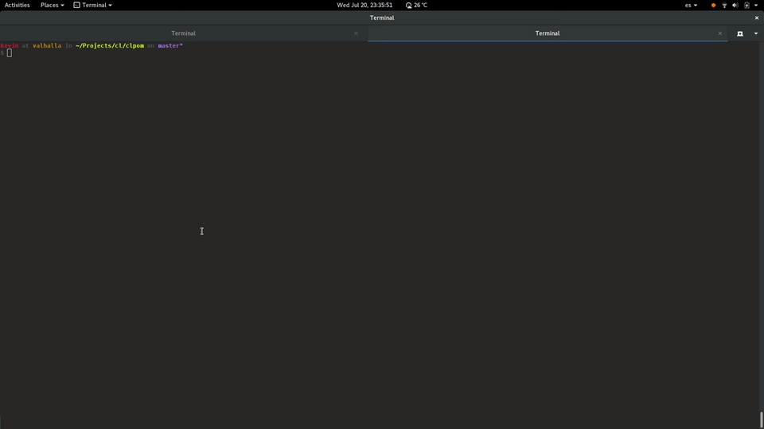

clpom
=====

A simple polyglot project manager written in Common Lisp.

* [x] Plugin based
* [x] Easy to catch DSL
* [x] Blazingly fast
* [x] Flat executable: no dependencies
* [x] Project generators
* [x] Interactive
* [x] Headless remote mode, exposing an HTTP Server
* [x] Support SH as dynamic native tasks
* [x] Native task name autocomplete

Quick Start (Common Lisp)
------------------------

")

Quick Start (Java :warning: In development :warning:)
---------------------------------------------------

")

Interactive Mode
----------------

SH Native Support
-----------------

Server Mode
-----------

### Get Task List

### Get Project Extras

### Run Task

